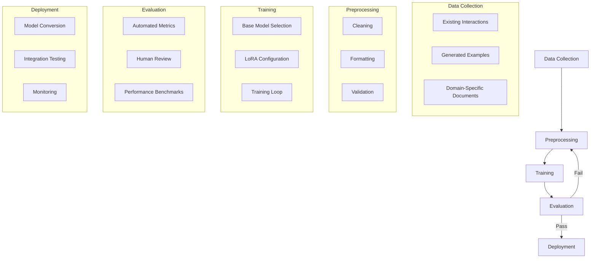

# STARWEAVE Fine-Tuning Strategy

## 1. Research Objectives

This document outlines our approach to researching and implementing fine-tuning for the Language Models (LLMs) used within the STARWEAVE ecosystem. Our primary goals are to:

- **Enhance Domain Understanding**: Improve the model's comprehension of pattern recognition, cognitive architectures, and distributed systems concepts central to STARWEAVE.
- **Optimize Performance**: Reduce prompt engineering overhead and improve response quality for common queries.
- **Increase Efficiency**: Potentially reduce context window requirements and computational costs for frequent operations.
- **Improve Consistency**: Ensure more predictable and structured outputs that align with STARWEAVE's architecture.

## 2. Benefits of Fine-Tuning

Investing in fine-tuning will provide several key advantages:

### Technical Benefits
- **Reduced Prompt Engineering**: Less need for complex prompt templates as domain knowledge gets baked into the model.
- **Faster Inference**: Fine-tuned models often require fewer tokens to achieve the same results.
- **Better Context Utilization**: More efficient use of context windows for complex reasoning tasks.

### User Experience Improvements
- More accurate and relevant responses to domain-specific queries
- Reduced latency for common operations
- More natural interaction patterns

### System Benefits
- Lower computational costs through more efficient processing
- Better resource utilization in distributed environments
- More consistent behavior across different deployment scenarios

## 3. Data Requirements

### Data Collection Strategy

We will focus on collecting and generating high-quality, domain-specific examples including:

1. **Pattern Recognition Scenarios**
   - Examples of pattern detection and analysis
   - Pattern evolution and transformation cases
   - Edge cases in pattern matching

2. **System Interactions**
   - Common user queries and ideal responses
   - Debugging and troubleshooting scenarios
   - System configuration and optimization queries

3. **Code Understanding**
   - Code explanation examples
   - API documentation and usage patterns
   - Common programming patterns in Elixir/OTP

4. **Memory and Context Management**
   - Context retention and retrieval examples
   - Multi-turn conversation patterns
   - Knowledge integration scenarios

### Data Quality Guidelines
- Each example should be clear, concise, and unambiguous
- Include diverse phrasings and approaches
- Cover both common and edge cases
- Ensure proper formatting and structure

## 4. Training Pipeline Architecture

### Key Components

1. **Data Pipeline**
   - Automated data collection from system interactions
   - Manual curation of high-quality examples
   - Data versioning and quality control

2. **Training Infrastructure**
   - Distributed training setup
   - Experiment tracking
   - Resource optimization

3. **Evaluation Framework**
   - Automated testing against benchmarks
   - Human evaluation workflows
   - Performance monitoring

4. **Deployment System**
   - Model conversion to optimized formats
   - A/B testing capabilities
   - Rollback procedures

## 5. Implementation Roadmap

### Phase 1: Research & Preparation
- [ ] Define evaluation metrics
- [ ] Set up data collection infrastructure
- [ ] Establish baseline performance

### Phase 2: Initial Implementation
- [ ] Create training pipeline
- [ ] Generate initial dataset
- [ ] Run first training experiments

### Phase 3: Evaluation & Iteration
- [ ] Evaluate model performance
- [ ] Refine training data
- [ ] Optimize training parameters

### Phase 4: Deployment
- [ ] Integrate with STARWEAVE
- [ ] Monitor performance
- [ ] Gather feedback

## 6. Risks & Mitigation

| Risk | Impact | Likelihood | Mitigation Strategy |
|------|--------|------------|---------------------|
| Poor quality training data | High | Medium | Rigorous data validation and curation |
| Overfitting to examples | High | High | Regular evaluation on held-out data |
| Training instability | High | Medium | Careful hyperparameter tuning |
| Integration challenges | Medium | Low | Early testing with STARWEAVE codebase |

## 7. Future Considerations

- Continuous learning from production data
- Specialized models for different components
- Integration with external knowledge bases
- Automated retraining pipelines
